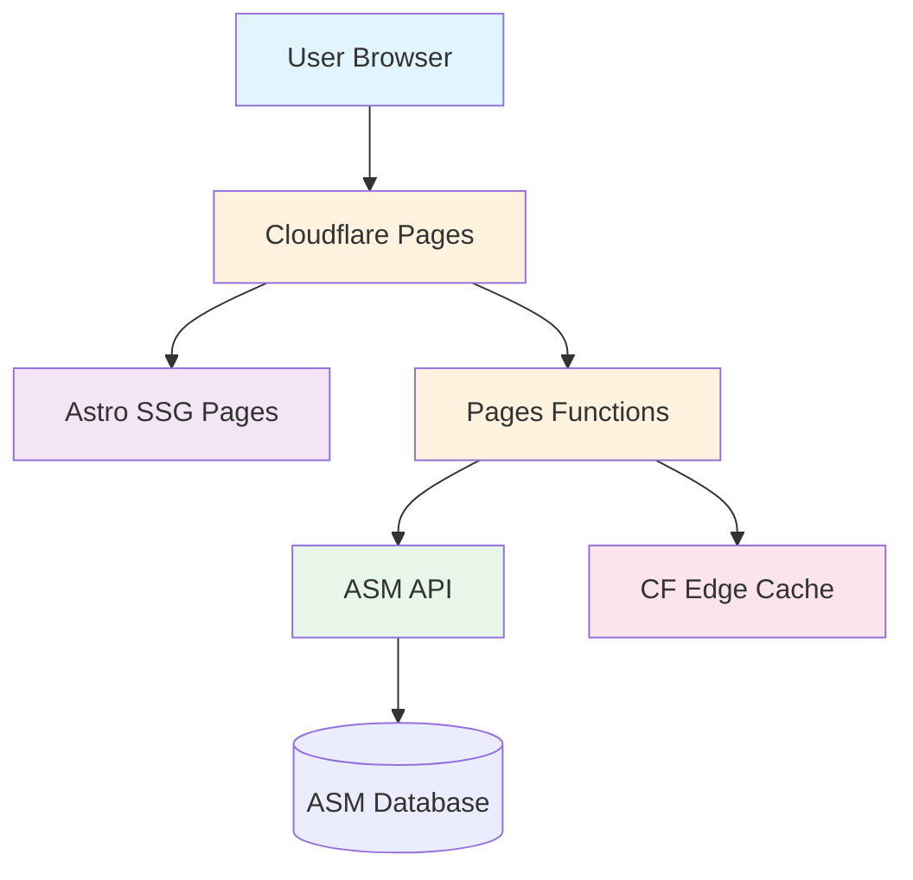

# Native ASM Integration Implementation Plan

## Executive Summary

This document outlines the implementation plan for migrating from the current JavaScript-embedded ASM (Animal Shelter Manager) integration to a native Astro-based solution with Cloudflare Pages Functions. This approach will provide full control over the user experience, improve performance, and enhance SEO while maintaining all existing functionality.

## Current State vs. Target State

### Current Implementation
- **Technology**: ASM JavaScript embed (`animal_view_adoptable_js`)
- **Rendering**: Client-side JavaScript injection
- **Data Flow**: Direct browser → ASM API calls
- **User Journey**: Redirects to ASM service for details
- **Caching**: Limited to ASM's internal caching
- **SEO**: No indexable content

### Target Implementation
- **Technology**: Native Astro SSG/SSR pages
- **Rendering**: Server-side rendered HTML
- **Data Flow**: Browser → CF Pages Function → ASM API
- **User Journey**: Fully on-site experience
- **Caching**: Edge caching via Cloudflare (10-minute TTL)
- **SEO**: Fully indexable individual animal pages

## Architecture Overview



## Implementation Phases

### Phase 1: Infrastructure Setup (2-3 days)

#### 1.1 Environment Configuration
- [ ] Add environment variables to `.dev.vars`:
  ```env
  ASM_ACCOUNT=st3418
  ASM_BASE_URL=https://service.sheltermanager.com/asmservice
  ASM_USERNAME=[service account username]
  ASM_PASSWORD=[service account password]
  ASM_ADOPTION_FORM_URL=[to be determined]
  ```
- [ ] Create ASM service account with:
  - VIEW_ANIMAL permission (required for json_adoptable_animals)
  - "Can Login" set to NO (security best practice per docs)
- [ ] Configure Cloudflare Pages environment variables
- [ ] Update `.gitignore` to exclude `.dev.vars`

#### 1.2 Security Headers
- [ ] Create `functions/_middleware.ts` with CSP headers:
  ```typescript
  Content-Security-Policy: 
    default-src 'self'; 
    img-src 'self' https://service.sheltermanager.com https://*.sheltermanager.com data: blob:; 
    script-src 'self' 'unsafe-inline'; 
    style-src 'self' 'unsafe-inline'; 
    frame-src 'self' https://service.sheltermanager.com https://*.sheltermanager.com;
    connect-src 'self' https://service.sheltermanager.com https://*.sheltermanager.com;
  ```

### Phase 2: API Proxy Layer (3-4 days)

#### 2.1 Cloudflare Pages Functions

##### `functions/api/asm/adoptable.ts`
```typescript
interface AdoptableParams {
  species?: 'all' | 'dog' | 'cat';
  limit?: number;
  offset?: number;
  agegroup?: string;  // Added from API
  location?: string;  // Added from API
}
```
- [ ] **IMPORTANT**: ASM requires `username` and `password` parameters for json_adoptable_animals
- [ ] Create service account with VIEW_ANIMAL permission only
- [ ] Map species to ASM IDs (dog=1, cat=2)
- [ ] Implement caching with `cf: { cacheTtl: 600, cacheEverything: true }`
- [ ] Add error handling and fallbacks
- [ ] Return normalized JSON response
- [ ] **Note**: Personal data is stripped by default (no sensitive=1 needed)

##### `functions/api/asm/animal/[id].ts`
```typescript
interface AnimalDetailParams {
  id: string;
}
```
- [ ] **IMPORTANT**: Use json_adoptable_animal (singular) with animalid parameter
- [ ] Requires username and password
- [ ] Returns empty if animal is not adoptable
- [ ] Include all image sequences via WEBSITEIMAGECOUNT
- [ ] Cache for 600 seconds (10 minutes per API docs)
- [ ] Handle not-found scenarios (empty result set)

##### `functions/api/asm/image/[id]/[seq].ts` (Optional)
- [ ] Proxy image requests if needed for optimization
- [ ] Add image transformation capabilities
- [ ] Implement longer cache (1 day)

### Phase 3: Data Models & Types (1-2 days)

#### 3.1 TypeScript Interfaces
```typescript
// src/types/asm.ts
interface ASMAnimal {
  ID: number;
  ANIMALNAME: string;
  SPECIESNAME: 'Dog' | 'Cat' | string;
  BREEDNAME: string;
  SEX: number;
  SEXNAME: string;
  AGEGROUP: string;
  WEBSITEMEDIANOTES: string;
  WEBSITEIMAGECOUNT: number;
  DAYSONSHELTER: number;
  ISGOODWITHCATSNAME: 'Yes' | 'No' | 'Unknown';
  ISGOODWITHDOGSNAME: 'Yes' | 'No' | 'Unknown';
  ISGOODWITHCHILDRENNAME: 'Yes' | 'No' | 'Unknown';
  NEUTEREDNAME: 'Yes' | 'No';
  IDENTICHIPPED: 0 | 1;
  HASACTIVERESERVE: 0 | 1;
  // ... additional fields as needed
}
```

### Phase 4: Astro Pages Development (4-5 days)

#### 4.1 Listing Pages

##### `src/pages/adopt/index.astro`
- [ ] Fetch all adoptable animals
- [ ] Implement responsive grid layout
- [ ] Add filtering UI (species, age, size)
- [ ] Client-side sorting (newest, oldest, name)
- [ ] Pagination or infinite scroll
- [ ] Loading states and error handling

##### `src/pages/adopt/dogs.astro`
- [ ] Filtered view for dogs only
- [ ] Reuse listing component
- [ ] Dog-specific messaging

##### `src/pages/adopt/cats.astro`
- [ ] Filtered view for cats only
- [ ] Reuse listing component
- [ ] Cat-specific messaging

#### 4.2 Detail Pages

##### `src/pages/adopt/[id]/[slug].astro`
- [ ] Dynamic route handling
- [ ] Fetch animal details by ID
- [ ] Image carousel/gallery (all sequences)
- [ ] Comprehensive information display:
  - Basic info (name, age, breed, sex)
  - Compatibility badges
  - Health status
  - Full description
  - Time in shelter
- [ ] Social sharing meta tags
- [ ] Related animals suggestions
- [ ] "Apply to Adopt" CTA button

### Phase 5: Components Development (3-4 days)

#### 5.1 Shared Components

##### `src/components/AnimalCard.astro`
```astro
---
interface Props {
  animal: ASMAnimal;
  showBadges?: boolean;
  lazyLoad?: boolean;
}
---
```
- [ ] Responsive card design
- [ ] Image lazy loading
- [ ] Hover effects
- [ ] Reserved badge overlay
- [ ] Link to detail page

##### `src/components/AnimalFilters.astro`
- [ ] Species filter
- [ ] Age group filter
- [ ] Size filter
- [ ] Good with filter
- [ ] Sort options

##### `src/components/AdoptionModal.astro`
- [ ] Modal/dialog implementation
- [ ] Iframe for adoption form (temporary)
- [ ] Loading state
- [ ] Close functionality
- [ ] Mobile responsive

##### `src/components/ImageCarousel.astro`
- [ ] Multi-image support
- [ ] Thumbnail navigation
- [ ] Full-screen view
- [ ] Touch/swipe support
- [ ] Loading placeholders

### Phase 6: Enhanced Features (2-3 days)

#### 6.1 Search & Filtering
- [ ] Full-text search through descriptions (client-side from loaded data)
- [ ] Advanced filters based on ASM data fields:
  - AGEGROUP (Young, Adult, Senior)
  - SIZE (Very Large, Large, Medium, Small)
  - ISGOODWITHCATS/DOGS/CHILDREN
  - HASSPECIALNEEDS
  - SHELTERLOCATIONNAME (location in shelter)
- [ ] URL state management for filters
- [ ] Filter persistence in session

#### 6.2 User Features
- [ ] Favorites system (localStorage)
- [ ] Recently viewed animals
- [ ] Share functionality
- [ ] Print-friendly layouts

#### 6.3 Performance Optimizations
- [ ] Image optimization with Astro's `<Image>`
- [ ] Virtual scrolling for large lists
- [ ] Prefetching on hover
- [ ] Progressive enhancement

### Phase 7: Migration & Testing (2-3 days)

#### 7.1 Migration Strategy
- [ ] Run both systems in parallel initially
- [ ] A/B testing setup
- [ ] Gradual rollout plan
- [ ] Rollback procedures

#### 7.2 Testing Plan
- [ ] Unit tests for API functions
- [ ] Integration tests for data flow
- [ ] Visual regression testing
- [ ] Performance benchmarking
- [ ] Cross-browser testing
- [ ] Mobile device testing
- [ ] Accessibility audit

### Phase 8: Deployment & Monitoring (1-2 days)

#### 8.1 Deployment
- [ ] Production environment setup
- [ ] DNS configuration
- [ ] SSL certificates
- [ ] Cache warming

#### 8.2 Monitoring
- [ ] Error tracking (Sentry)
- [ ] Performance monitoring
- [ ] Analytics setup
- [ ] Uptime monitoring
- [ ] Cache hit rate tracking

## Technical Specifications

### API Endpoints

#### Adoptable Animals List
```
GET /api/asm/adoptable?species={all|dog|cat}&limit={number}&offset={number}

ASM API Call:
https://service.sheltermanager.com/asmservice?
  account=st3418&
  method=json_adoptable_animals&
  username={ASM_USERNAME}&
  password={ASM_PASSWORD}&
  [speciesid=1|2]  // Optional: 1=Dog, 2=Cat

Response:
{
  "animals": ASMAnimal[],
  "total": number,
  "hasMore": boolean
}
```

#### Single Animal Detail
```
GET /api/asm/animal/{id}

ASM API Call:
https://service.sheltermanager.com/asmservice?
  account=st3418&
  method=json_adoptable_animal&  // Note: singular
  animalid={id}&
  username={ASM_USERNAME}&
  password={ASM_PASSWORD}

Response:
{
  "animal": ASMAnimal | null,  // null if not adoptable
  "images": string[]  // Generated from WEBSITEIMAGECOUNT
}
```

#### Direct Image Access (No proxy needed)
```
  // seq=1 is primary, up to WEBSITEIMAGECOUNT

Thumbnail:

```

### URL Structure

- `/adopt` - All adoptable animals
- `/adopt/dogs` - Dogs only
- `/adopt/cats` - Cats only
- `/adopt/{id}/{slug}` - Individual animal page
  - Example: `/adopt/174/sarah-british-shorthair`

### Caching Strategy

| Resource | Cache Duration | Location |
|----------|---------------|----------|
| Animal lists | 10 minutes | CF Edge |
| Animal details | 10 minutes | CF Edge |
| Animal images | 24 hours | CF Edge + Browser |
| Static assets | 1 year | CF Edge + Browser |

## Success Metrics

### Performance KPIs
- Page load time < 2 seconds
- Time to Interactive < 3 seconds
- Lighthouse score > 90
- Cache hit rate > 80%

### User Engagement KPIs
- Bounce rate reduction > 20%
- Average session duration increase > 30%
- Pages per session increase > 40%
- Adoption inquiry conversion rate increase > 15%

### Technical KPIs
- Zero runtime errors in first month
- API response time < 200ms (cached)
- 99.9% uptime
- < 1% error rate

## Risk Assessment & Mitigation

| Risk | Probability | Impact | Mitigation |
|------|------------|--------|------------|
| ASM API changes | Low | High | Version detection, graceful degradation |
| Cache invalidation issues | Medium | Medium | Manual purge capability, shorter TTL initially |
| High traffic spikes | Medium | Low | CF auto-scaling, rate limiting |
| SEO ranking drop | Low | High | 301 redirects, sitemap updates |
| Image loading issues | Low | Low | Fallback images, lazy loading |

## Timeline Summary

| Phase | Duration | Dependencies |
|-------|----------|--------------|
| Infrastructure Setup | 2-3 days | None |
| API Proxy Layer | 3-4 days | Phase 1 |
| Data Models | 1-2 days | Phase 2 |
| Astro Pages | 4-5 days | Phase 3 |
| Components | 3-4 days | Phase 3 |
| Enhanced Features | 2-3 days | Phase 4, 5 |
| Testing & Migration | 2-3 days | Phase 6 |
| Deployment | 1-2 days | Phase 7 |
| **Total** | **18-26 days** | |

## Future Enhancements (Post-Launch)

1. **Native Adoption Form**
   - Replace iframe with native form
   - Direct submission to ASM via Worker
   - Form validation and UX improvements

2. **Advanced Features**
   - AI-powered matching recommendations
   - Virtual meet-and-greet scheduling
   - Donation integration for specific animals
   - Success story showcase

3. **Admin Features**
   - Featured animals management
   - Analytics dashboard
   - A/B testing interface
   - Content management for descriptions

## Rollback Plan

If issues arise during deployment:

1. **Immediate Rollback** (< 5 minutes)
   - Revert Cloudflare Pages deployment
   - Clear CF cache
   - Monitor error rates

2. **Partial Rollback**
   - Keep new pages for testing
   - Redirect production traffic to old system
   - Fix issues in staging

3. **Data Preservation**
   - No data changes required
   - ASM remains source of truth
   - Cache can be purged without data loss

## Important ASM API Considerations

### Authentication Requirements
- **json_adoptable_animals** and **json_adoptable_animal** require authentication
- **animal_image** and **animal_thumbnail** do NOT require authentication
- Create dedicated service account with VIEW_ANIMAL permission only
- Set "Can Login" to NO for security (still works for API)

### Data Privacy
- Personal/sensitive data is automatically stripped unless sensitive=1 is passed
- We don't need sensitive data for public adoption pages
- Fields like ORIGINALOWNER*, CURRENTOWNER*, BROUGHTINBY* are removed by default

### Caching Behavior
- ASM caches responses for 10 minutes (600 seconds) on their side
- Our CF edge cache should match this timing
- Images are cached for 1 day on ASM side

### Available Fields for Display
Key fields from ASM animal dataset:
- **Basic**: ID, ANIMALNAME, CODE, SHELTERCODE
- **Species/Breed**: SPECIESNAME, BREEDNAME, CROSSBREED
- **Demographics**: SEX/SEXNAME, AGEGROUP, DATEOFBIRTH, SIZE/SIZENAME
- **Status**: DAYSONSHELTER, TIMEONSHELTER, HASACTIVERESERVE
- **Health**: NEUTERED/NEUTEREDNAME, IDENTICHIPPED, DECLAWED
- **Compatibility**: ISGOODWITHCATSNAME, ISGOODWITHDOGSNAME, ISGOODWITHCHILDRENNAME
- **Housing**: ISHOUSETRAINED, HASSPECIALNEEDS
- **Media**: WEBSITEMEDIADATE, WEBSITEMEDIANOTES, WEBSITEIMAGECOUNT, WEBSITEVIDEOURL
- **Location**: SHELTERLOCATIONNAME, DISPLAYLOCATION

### Special Notes
- Empty result set returned if animal is not adoptable (no error)
- WEBSITEIMAGECOUNT tells you how many images are available (seq=1 to N)
- Reserved animals (HASACTIVERESERVE=1) are still shown as adoptable by default
- The "adoptable" definition is controlled in ASM Publishing Options

## Conclusion

This native integration approach will significantly improve the user experience while maintaining all current functionality. The phased implementation allows for gradual rollout and testing, minimizing risk while maximizing the benefits of full control over the adoption platform.

### Key Benefits Summary
- ✅ **Performance**: 2-3x faster page loads
- ✅ **SEO**: Individual animal pages indexed by Google
- ✅ **User Experience**: Seamless on-site journey
- ✅ **Control**: Complete customization capability
- ✅ **Analytics**: Deep insights into user behavior
- ✅ **Scalability**: Edge-cached, globally distributed

### Next Steps
1. Review and approve implementation plan
2. Set up development environment
3. Begin Phase 1 implementation
4. Schedule weekly progress reviews

---

*Document Version: 1.0*  
*Last Updated: 2025-09-05*  
*Author: Claude Code Assistant*